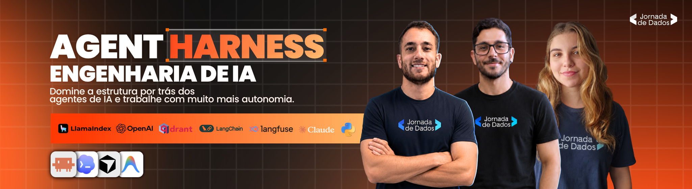

<div align="center">



# Workshop Agent Harness · Jornada de Dados

Workshop de **Agent Harness** da **Jornada de Dados**: como organizar o repositório e os arquivos
que o Claude Code usa — **rules, hooks, MCP, subagents e skills** — **antes** de escrever a primeira
linha de código, conduzindo um projeto real do PRD às issues e à implementação medida.

[**🎓 Workshop**](https://lp.suajornadadedados.com.br/agent-harness) • [**📖 Documentação**](https://github.com/caio-moliveira/workshop-agent-harness) • [**🌐 Site Oficial**](https://suajornadadedados.com.br/)

</div>

---

## O projeto · Agente Analítico de Vendas

Assistente agêntico que costura **text-to-SQL** (Postgres, somente leitura) com **recuperação
qualitativa** (Qdrant) para gerar **relatórios de melhoria de vendas fundamentados** — cruzando o
*o quê* (números) com o *porquê* (voz do cliente) e o *o que fazer* (playbooks que já funcionaram).

É um **produto de mundo real construído ao vivo**. O foco não é só o app: é o **método** — sair de
uma ideia solta e chegar em issues prontas para um agente implementar, governado por um **agent
harness** que codifica os padrões, as validações e as métricas de um time de verdade.

> Este README conta **como chegamos até aqui**: o que já estava posto, o harness que montamos à mão
> e os próximos passos — da *ideia* → *PRD* → *harness* → *issues* → *implementação medida*.

---

## 1. O que já está posto (antes do workshop)

Quatro coisas foram preparadas **antes** de a parte ao vivo começar:

| O quê | Onde | Estado |
|---|---|---|
| **Ingestão dos dados** | `seed/` | ✅ ~5 anos de vendas no Postgres + corpus qualitativo no MinIO/Qdrant, com narrativas plantadas (`seed/NARRATIVAS.md`) |
| **Stack local (docker-compose)** | `docker-compose.yml` | ✅ `postgres` · `qdrant` · `minio` · `api` (FastAPI) · `nginx` |
| **Ambiente git** | `.git`, `.gitignore`, `.env.example` | ✅ repositório configurado com `uv` (Python 3.13) |
| **Download das SKILLS** | `skills-lock.json` + `.claude/skills/` | ✅ fontes abaixo |

### Fontes das skills (download)

As skills foram baixadas e travadas em `skills-lock.json` (fonte + `skillPath` + hash de cada uma):

- **Matt Pocock** — skills de processo (`grill-me`, `to-prd`, `to-issues`,
  `tdd`, `diagnose`, `triage`, `handoff`, `write-a-skill`, `zoom-out`…):
  <https://github.com/mattpocock/skills>
- **LangChain / LangGraph / Deep Agents** (`ecosystem-primer`, `langchain-*`, `langgraph-*`,
  `deep-agents-*`, `managed-deep-agents`, `swarm`): <https://github.com/langchain-ai/langchain-skills>
- **FastAPI patterns** (`fastapi-patterns`): <https://github.com/affaan-m/ECC>
- **React** (`react`): <https://github.com/lobehub/lobehub> · **React UI patterns** (`react-ui-patterns`):
  <https://github.com/sickn33/antigravity-awesome-skills>
- **UI/UX Pro Max** (`ui-ux-pro-max`): <https://github.com/nexu-io/open-design>

> **`harness-architect` é uma skill _própria_ da equipe** (não está no `skills-lock.json`): ela
> automatiza o scaffold do `.claude/` a partir do PRD. No workshop, porém, **montamos o harness à
> mão** — o objetivo é entender o que cada arquivo faz e por que existe, não gerá-los no escuro. A
> skill fica como a automação opcional, depois que os conceitos estão claros.

---

## 2. Do PRD ao código

Cada passo consome o artefato do anterior. A ordem importa: **alinhar antes de gerar, harness antes
de codar, validar a cada fatia.**

| # | Passo | Origem | Entra | Sai | Estado |
|---|---|---|---|---|---|
| 0 | `ideia.md` | — | — | a ideia inicial | ✅ |
| 1 | `/grill-me` | Matt Pocock | `ideia.md` | entendimento afiado | ✅ |
| 2 | `/to-prd` | Matt Pocock | sessão do grill | **`PRD.md`** | ✅ |
| 3 | **harness à mão** | nós (ao vivo) | `PRD.md` | `.claude/` (rules · hooks · MCP · subagente · comandos · métricas) | ✅ |
| 4 | `/to-issues` | Matt Pocock | `PRD.md` | issues *ready-for-agent* | ⬜ |
| 5 | implementar | — | issues | código (gate + revisor + scorecard) | ⬜ |

**0. `ideia.md` — a semente.** Documento solto com a ideia inicial. Fica **local e não versionado**,
mas é a origem de toda a cadeia.

**1. `/grill-me` — interrogar a ideia.** Entrevista o autor sem dó até fechar cada ramo da árvore de
decisões. Não gera arquivo: afia o entendimento que vai alimentar o PRD.

**2. `/to-prd` — consolidar o PRD.** Sintetiza a conversa num PRD, sem nova entrevista.
→ **Output: `PRD.md`** — Problem/Solution, user stories, Implementation/Testing Decisions, Out of Scope.

**3. O harness, à mão — estruturar o `.claude/`** *(centro do workshop)*. Lendo o `PRD.md`, montamos
os arquivos do harness **um a um**, entendendo o papel de cada peça. Detalhe na seção 3.
→ **Output:** `CLAUDE.md`, `.claude/rules/`, `.claude/agents/`, `.claude/commands/`,
`.claude/settings.json` (hooks + permissões), `.mcp.json` e `metrics/`.

**4. `/to-issues` — fatiar o PRD.** Quebra o `PRD.md` em issues *ready-for-agent* (fatias verticais
tracer-bullet), cada uma independentemente "grabbable". O tracker (GitHub via `gh`) e o vocabulário de
labels já estão documentados no `CLAUDE.md` — não há passo de setup separado.

**5. Implementar.** O ciclo roda fatia a fatia com **gate automático** (hook: `ruff` + `mypy` +
`pytest`), **revisão** pelo subagente `revisor-codigo` e **métricas de entrega** medidas contra a
Definição de Pronto (`/scorecard`).

```bash
# o harness já está montado (.claude/). Próximos comandos do workshop:
/to-issues                    # PRD.md -> issues ready-for-agent           (passo 4)
# implementar issue a issue: gate (hook) + /validar + revisor-codigo + /scorecard
```

---

## 3. O harness que montamos (`.claude/`)

Não é um template genérico: cada arquivo amarra um **padrão do time** a um **comportamento que
queremos garantir**.

| Peça | Arquivo | O que faz |
|---|---|---|
| **rules** | `.claude/rules/*.md` | Padrões por área (estilo, backend, agente, frontend, testes), *path-scoped* via `paths:` — carregam só quando o agente toca a área. |
| **hooks** | `.claude/settings.json` | `PostToolUse` aplica `ruff` a cada edição; `Stop` roda `ruff + mypy + pytest` e **bloqueia** se vermelho. Mais as permissões (perímetro). |
| **MCP** | `.mcp.json` | Postgres **somente-leitura** (`--access-mode=restricted`) para o agente inspecionar o schema real antes de escrever SQL. |
| **subagent** | `.claude/agents/revisor-codigo.md` | Revisor que checa o diff contra as rules + invariantes, em janela fresca (verificação *soft*). |
| **commands** | `.claude/commands/` | `/validar` (gate invocável) e `/scorecard` (métricas de entrega). |
| **skills** | `.claude/skills/` | As skills baixadas (Matt, LangChain…) — procedimentos reutilizáveis carregados sob demanda. |
| **métricas** | `.claude/rules/definicao-de-pronto.md` + `metrics/` | Definição de Pronto (contrato mensurável de "entregue") + `entregas.jsonl`, agregados pelo `/scorecard`. |

O `CLAUDE.md` na raiz é o **índice durável** do projeto (invariantes, stack, comandos), carregado em
toda sessão. Invariantes que o harness protege: `negocio` é **somente leitura**; grafo LangGraph
**determinístico**; enriquecimento Qdrant **sempre filtrado** por `periodo_referencia`; toda
recomendação **amarrada a uma fonte**; stores pré-populados são **sagrados**.

---

## 4. Estrutura do repositório

```
agent-harness-apresentacao.html  # apresentação do workshop
PRD.md                           # PRD consolidado (output do /to-prd) — base para as issues
CLAUDE.md                        # índice durável do projeto (carregado toda sessão)
docker-compose.yml               # stack: postgres, qdrant, minio, api (FastAPI), nginx
.env.example                     # variáveis (copie para .env antes de subir)
pyproject.toml                   # deps (uv) · uv.lock
skills-lock.json                 # lock das skills baixadas (fonte + skillPath + hash)
.mcp.json                        # MCP: Postgres somente-leitura
seed/                            # ingestão: dataset sintético + corpus (offline, já executada)
  schema.sql                     #   DDL do schema `negocio` (dimensões + fatos + metas)
  generate.py · load.py          #   gerador determinístico -> CSVs -> COPY no Postgres
  corpus/ · ingest.py            #   docs .md (diagnostico/ + prescricao/) -> MinIO + Qdrant
  NARRATIVAS.md · evals/golden/  #   enredo das narrativas + golden dataset derivado
.claude/
  settings.json                  #   hooks (estilo + gate de validação) + permissões
  rules/                         #   padrões por área (path-scoped via `paths:`)
  agents/revisor-codigo.md       #   subagente revisor (verificação soft)
  commands/                      #   /validar · /scorecard
  skills/                        #   skills baixadas + harness-architect (própria)
metrics/                         # métricas de entrega: entregas.jsonl + README (schema)
```

> `backend/` (FastAPI + grafo LangGraph) e `frontend/` (React + Vite) **nascem das issues** durante
> a implementação — são o resultado do passo 6, não pré-requisito.

---

## 5. Rodar localmente (ingestão)

```bash
cp .env.example .env                          # ajuste os segredos (POSTGRES_PASSWORD etc.)
docker compose up -d postgres qdrant minio    # stores no ar

# 1) Postgres (vendas + metas)
uv run python seed/generate.py                # gera seed/data/*.csv (regenerável; não versionado)
uv run python seed/load.py                    # cria negocio.* e carrega; sanity das narrativas

# 2) Corpus qualitativo (MinIO -> Qdrant)
uv run python seed/ingest.py                  # upload + embed + index; verifica buscas filtradas
```

Consoles: **MinIO** em <http://localhost:9001> · **Qdrant** em <http://localhost:6333/dashboard>.
